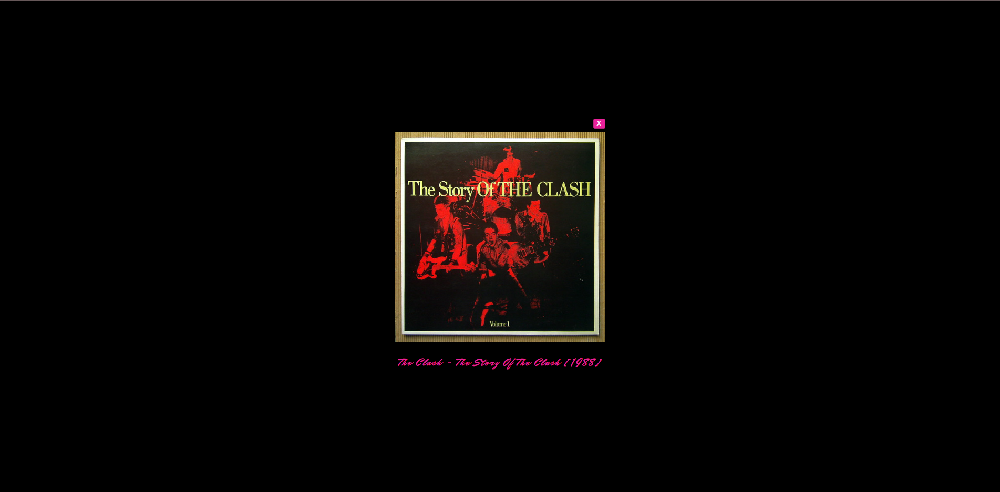

# React Gallery App

---

## Installation

In the projects root directory you can run:

### `npm install`

This is download all the necessary dependencies to run the project.

---

In the terminal, move to the project folder with:

### `cd react-gallery`

Then:

### `npm start`

---

## For more information on different scripts, see below.

# React Commands

This project was bootstrapped with [Create React App](https://github.com/facebook/create-react-app).

## Available Scripts

In the project directory, you can run:

### `npm start`

Runs the app in the development mode.<br />
Open [http://localhost:3000](http://localhost:3000) to view it in the browser.

The page will reload if you make edits.<br />
You will also see any lint errors in the console.

### `npm test`

Launches the test runner in the interactive watch mode.<br />
See the section about [running tests](https://facebook.github.io/create-react-app/docs/running-tests) for more information.

### `npm run build`

Builds the app for production to the `build` folder.<br />
It correctly bundles React in production mode and optimizes the build for the best performance.

The build is minified and the filenames include the hashes.<br />
Your app is ready to be deployed!

See the section about [deployment](https://facebook.github.io/create-react-app/docs/deployment) for more information.

### `npm run eject`

**Note: this is a one-way operation. Once you `eject`, you can’t go back!**

If you aren’t satisfied with the build tool and configuration choices, you can `eject` at any time. This command will remove the single build dependency from your project.

Instead, it will copy all the configuration files and the transitive dependencies (webpack, Babel, ESLint, etc) right into your project so you have full control over them. All of the commands except `eject` will still work, but they will point to the copied scripts so you can tweak them. At this point you’re on your own.

You don’t have to ever use `eject`. The curated feature set is suitable for small and middle deployments, and you shouldn’t feel obligated to use this feature. However we understand that this tool wouldn’t be useful if you couldn’t customize it when you are ready for it.

## Learn More

You can learn more in the [Create React App documentation](https://facebook.github.io/create-react-app/docs/getting-started).

To learn React, check out the [React documentation](https://reactjs.org/).

### Code Splitting

This section has moved here: https://facebook.github.io/create-react-app/docs/code-splitting

### Analyzing the Bundle Size

This section has moved here: https://facebook.github.io/create-react-app/docs/analyzing-the-bundle-size

### Making a Progressive Web App

This section has moved here: https://facebook.github.io/create-react-app/docs/making-a-progressive-web-app

### Advanced Configuration

This section has moved here: https://facebook.github.io/create-react-app/docs/advanced-configuration

### Deployment

This section has moved here: https://facebook.github.io/create-react-app/docs/deployment

### `npm run build` fails to minify

This section has moved here: https://facebook.github.io/create-react-app/docs/troubleshooting#npm-run-build-fails-to-minify

---

# Explanation

This project is a modern approach to building single page apps using React and React Router libraries. The project is a gallery app that uses Flickr's API to search for images the user looks up. The project uses React to build a modular component style that can be easily scaled up due to the ease of reusable components. The project also uses React Router to handle page routing in the app because React itself does not have built in tools to handle that. The theme of the project is based off of my favorite music to listen to while coding: Vaporwave.

For a live demo if this project, go to this link: https://react-gallery-1.netlify.app/

## Motivation

---

The motivation of this project is to highlight my working knowledge of React, communicating with web servers using their API(in this case Flickr), and how to set up routing while using the React Framework

This project taught me how to:

- Use React framework to write single page web applications
- Using state to update various parts of the application between renders
- Writing reusable functional/ class components
- Using modern practices to communicate with web-servers via API's
- Understanding Reacts life cycle methods to properly update the app in various states
- How to use React Router to set up the applications different pages
- Best practices on error handling for best user experience(ex. returning no searches, pages not available)
- Use JSX, Reacts templating language that creates DOM elements to describe how the UI should look

## Technology Used

---

This project uses the following technologies:

- React (source: https://reactjs.org/)
- React Router (source: https://reacttraining.com/react-router/web/guides/quick-start)
- Axios (source: https://github.com/axios/axios)
- Netlify(Hosting) (source: https://www.netlify.com/)
- CSS
- Vanilla JS
- JSX (source: https://reactjs.org/docs/introducing-jsx.html)
- Flickr API (source: https://www.flickr.com/services/api/ )

## Features

---

1. Modern web development using React and React Router to build single page applications
2. Search feature that fetches images from Flickr API and presents them on the page
3. Routing that creates a single page app experience
4. Modal window so the user can see the images more clearly as well as the title of the image
5. A loading indicator so the user is never presented with a blank page when performing searches
6. Error handling for when the users search doesn't return a result as well as when they visit a non existent page.
7. A fun, campy design meant to bring more interest to the user

## Code Example

---

Data Fetching using Axios

- Axios is a library that is compatible with more browsers and legacy versions of those browsers than standard Fetch requests via Ajax, Promises, Fetch, or Async/Await

This snippet of code uses the users input to make a call to Flickr's server to fetch data based on their search input

```
  searchQuery = (input) => { //Input being whatever the user typed in
    const url = `https://www.flickr.com/services/rest/?method=flickr.photos.search&api_key=${apiKey}&tags=${input}&per_page=24&page=1&format=json&nojsoncallback=1`;
    axios
      .get(url)
      .then((res) => {
        console.log(res);
        this.setState({
          images: res.data.photos.photo,
          loading: false,
          input: input,
        });
      })
      .catch((error) => {
        console.log("error fetching data", error);
      });
  };
```

This snippet uses Reacts life-cycle methods to properly update the projects state. When the app first loads componentDidMount will mount the search component and update the state. Then after each search, ComponentDidUpdate will update the state once again to accurately show the searched images.

```

  componentDidMount() {
    let pathName = this.props.history.location.pathname;
    if (pathName.includes("/search")) {
      pathName = pathName.substring(8);
    } else {
      pathName = pathName.substring(1);
    }

    this.searchQuery(pathName);
  }

  componentDidUpdate(prevProps) {
    let pathName = prevProps.history.location.pathname;

    if (pathName.includes("/search")) {
      pathName = pathName.substring(8);
    } else {
      pathName = pathName.substring(1);
    }

    if (pathName !== this.state.input) {
      this.setState({
        loading: true,
      });
      this.searchQuery(pathName);
    }
  }

```

React Router

```
//App.js Routing

<Switch>
    <Route exact path="/" render={() => <Redirect to={"/vaporWave"} />} />
    <Route
    exact
    path="/vaporWave"
    render={(props) => (
        <ImageContainer
        {...props}
        loading={this.state.loading}
        name={this.state.input}
        images={this.state.images}
        />
    )}
    />
    <Route
    exact
    path="/80s"
    render={(props) => (
        <ImageContainer
        {...props}
        loading={this.state.loading}
        name={this.state.input}
        images={this.state.images}
        />
    )}
    />
    <Route
    exact
    path="/chillHop"
    render={(props) => (
        <ImageContainer
        {...props}
        loading={this.state.loading}
        name={this.state.input}
        images={this.state.images}
        />
    )}
    />
    <Route
    exact
    path="/search/:id"
    render={(props) => (
        <ImageContainer
        {...props}
        loading={this.state.loading}
        name={this.state.input}
        images={this.state.images}
        />
    )}
    />
    <Route component={NotFound} />
</Switch>

//Nav.js Navlinks

   <nav className="main-nav">
      <ul>
        <li>
          <NavLink to="/vaporWave">Vaporwave</NavLink>
        </li>
        <li>
          <NavLink to="/80s">80's</NavLink>
        </li>
        <li>
          <NavLink to="/chillHop">Chill Hop</NavLink>
        </li>
      </ul>
    </nav>

```

A reusable component in app that creates the image container for each image

```
import React from "react";
import Image from "./Image";
import NoResults from "./NoResults";
import PropTypes from "prop-types";
import Loader from "./Loader";

/**
 * Takes query, adds to string, creates URL
 * and creates image container
 *
 * @component Imagescontainer
 *
 */
const ImagesContainer = ({ images, name, loading }) => {
  const results = images;
  let imagesVar;

  //maps over the data and creates a gif component each time through the array

  imagesVar = results.map((image) => (
    //pushs url data to image container
    <Image
      url={`https://farm${image.farm}.staticflickr.com/${image.server}/${image.id}_${image.secret}.jpg`}
      key={image.id}
      title={image.title}
    />
  ));

  if (loading) {
    console.log();
    return <Loader />;
  }

  if (results.length <= 0) {
    return <NoResults />;
  } else {
    return (
      <div className="photo-container">
        <h2 className="future glow">Results for {name}</h2>
        <ul>{imagesVar}</ul>
      </div>
    );
  }
};
```

## Screenshots

---





## Style Changes

---

The following style changes to the original Treehouse project are as noted:

1. Colors, background changed
2. Added modal window for added UI experience
3. CSS animations added
4. Topic button sizing altered
5. Added loading animation

## License

---

MIT © Jamie Gobeille 2020

```

```
